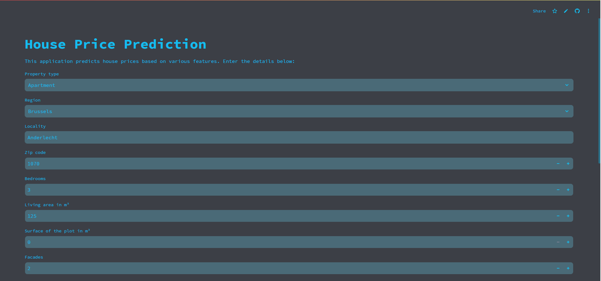
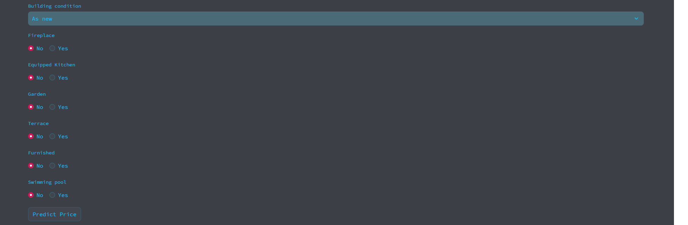

# Immo Eliza Deployement

## Description

Deployement of the Immo Eliza project in an usable app with streamlit.

    - The "app.py" file, make the interface of the app, and unsure good format for the values input by the user.
    - The "cleaning_data.py" file, format the user input in the same way that we trained the model in the Immo Eliza Regression project.
    - The "prediction.py" file, make a prediction of price depending on the input of user
    - it also contain a "model" folder with the already trained model and scaler for the formating of the data

## Installation

    - python -m venv env
    - pip install -r requirements.txt

## Usage

    Applicaction already deployed et : [Link to app](https://immoelizadeployment-fl.streamlit.app/)

    or

    - pip install streamlit
    - streamlit run Project/app.py

## Visuals

## Personal Throught 

    Hello! This is the final part of the Red Line Project at BeCode.

    Throughout the project, I faced several challenges—especially with the machine learning aspects, which I spent a significant amount of time trying to understand.

    While the project is not perfect, here are some key points I learned:

        - The dataset had its limitations, and I faced difficulties in working with it.

        - As I had no prior knowledge of machine learning, my focus was more on understanding the steps involved in the process rather than perfection. As a result, I spent a lot of time on minor issues that affected the overall state of the project.

    That being said, this project taught me a lot, and I believe I won't make the same mistakes in the future!